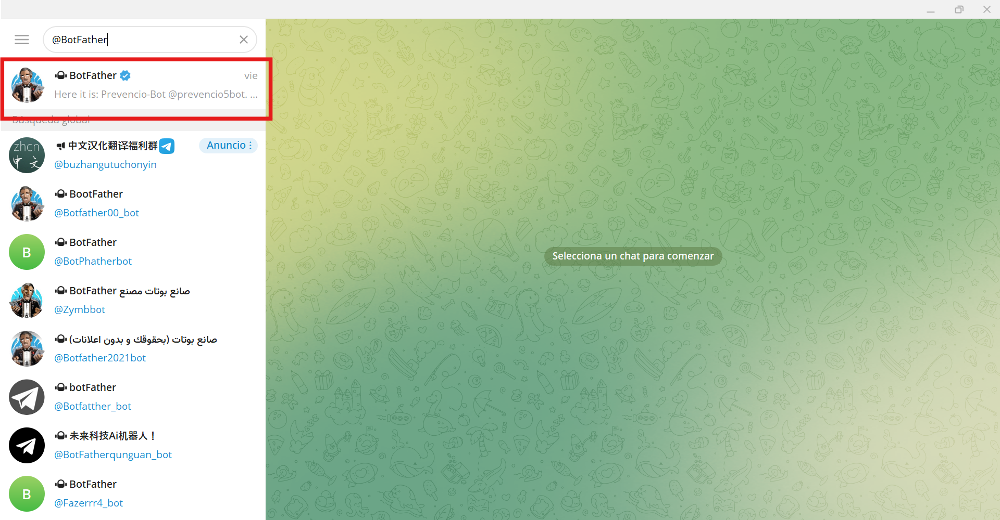
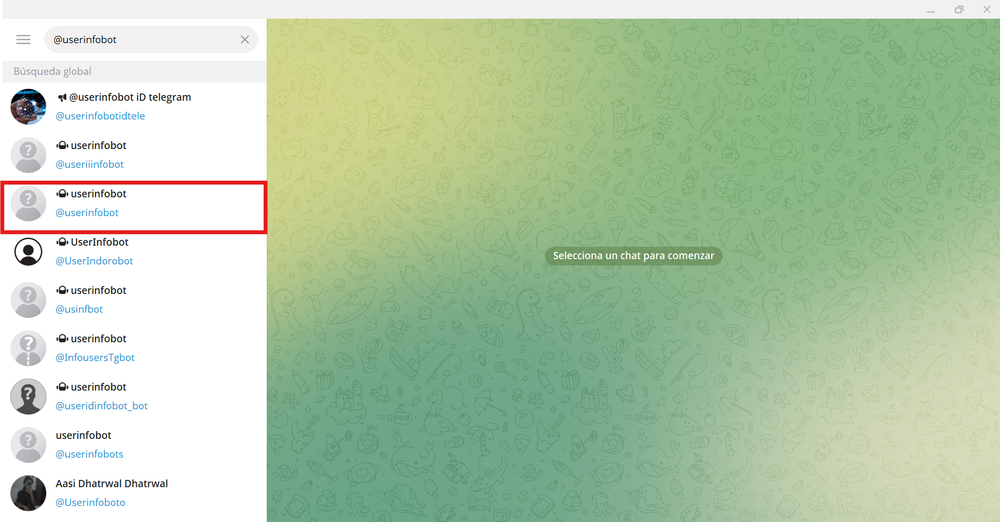
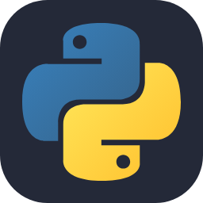

# Trabajo de Fin de Grado

## 🤖 Bot de Telegram para consultas sobre riesgos laborales de las PYMES

Este es un asistente de Telegram que utiliza el modelo de lenguaje de Google Gemini para generar respuestas 
a las preguntas de los usuarios que quieran saber sobre los riesgos laborales de las Pymes en España.

### Autor: Enrique Cogolludo Fernández

## 🖥️ Configuración
1. Clona este repositorio.
2. Activa el modo desarrollador en tu pc o portátil.
3. Instala las dependencias usando 'pip install -r requirements.txt' en la terminal.
4. Crea un bot en Telegram a través de BotFather y reemplaza 'TELEGRAM_TOKEN' en el fichero de 
variables de entorno '.env' con tu token.
5. Obtén tu ID de usuario de Telegram y reemplaza 'TELEGRAM_USER_ID' en el fichero de variables 
de entorno '.env' con tu token.
6. Crea una API KEY en la web oficial de Google Gemini <https://gemini.google.com/app?hl=es-ES> y reemplaza
'GOOGLE_API_KEY' en el fichero de variables de entorno '.env' con tu API KEY.
7. Crea una API KEY en la web oficial de SerpAPI <https://serpapi.com/> y reemplaza 'SERPAPI_KEY' en el 
fichero de variables de entorno '.env' con tu API KEY.
8. Ejecuta el bot ejecutando el programa 'bot_chat_gemini.py' o escribiendo <python bot_chat_gemini.py> 
en tu terminal.
9. Abre Telegram y conversa con tu asistente.

## Pasos para activar el modo desarrollador en Windows 
1. Ve a la configuración del sistema 
2. Accede a la pestaña 'Sistema'
3. Busca y accede a la opción 'Para programadores'
4. Activa la opción 'Modo para desarrolladores'

## Pasos para crear un bot en Telegram a través de BotFather y obtener tu token propio
1. Descargar la aplicación de Telegram Desktop a través del siguiente enlace <https://desktop.telegram.org/>.
(También puedes usar la aplicación de Telegram desde tu dispositivo móvil descargándola desde la App Store o Play Store).
2. Abre Telegram y en la barra de búsqueda de Telegram, escribe @BotFather, es un bot oficial de Telegram
con una verificación azul.

3. Inicia una conversación con BotFather, haz click en Start o escribe /start.
4. Crea un nuevo bot, escribe el comando, /newbot, BotFather te pedirá dos cosas:
    - El nombre del bot (puedes elegir el que quieras, por ejemplo, Asistente Personal).
    - Nombre del usuario del bot (debe de acabar en bot, por ejemplo AsistentePersonal_bot o MiAsistente123_bot)
5. Una vez completado el paso anterior, BotFather te enviará un mensaje con un token de API. 
Guarda este token en un lugar seguro porque lo necesitarás para interactuar con el bot desde tu código.
6. Configura tu propio bot (opcional):
    - /setdescription - Describe lo que hace tu bot
    - /setbouttext - Texto corto que aparece en la biografía
    - /setuserpic - Cambiar la foto de perfil
    - /setcommands - Definir comandos personalizados (por ejemplo, /ayuda, /start)
7. Ahora tu bot ya está creado y disponible en Telegram. Puedes buscarlo por su nombre de usuario y empezar a hablar con él.

## Pasos para obtener tu Telegram User ID
1. Abre la aplicación de Telegram en tu dispositivo 
2. En la barra de búsqueda de Telegram, escribe @userinfobot y selecciona el bot que aparezca.

3. Haz clic en "Iniciar" para comenzar la conversación con el bot.
4. El bot te mostrará tu ID de usuario que debes sustituir en el archivo '.env' del código.

## Pasos para crear una API KEY de Google Gemini 
1. Ve a <https://makersuite.google.com/app> 
2. Inicia sesión con tu cuenta de Google o crea una nueva.
3. Accede a la sección API Key en <https://aistudio.google.com/app/apikey>.
4. Haz click en Create API Key. Se generará tu API Key.

## Pasos para crear una API KEY de SerpAPI 
1. Ve al sitio oficial de SerpAPI <https://serpapi.com/>
2. Crea una cuenta o inicia sesión
    - Puedes registrarte con email, Google  o GitHub.
    - Confirma tu correo si es necesario.
3. Accede a tu API Key, una vez dentro:
    - Ve a tu panel de control (dashboard): <https://serpapi.com/dashboard>.
    - Verás tu API Key personal listada ahí.

## Herramientas utilizadas
Este trabajo ha sido desarrollado utilizando las siguientes herramientas:
- Pycharm Professional v2025.1.1 (Licencia adquirida gratuita gracias a la colaboración con la universidad) 
- Python 3.13 
- Telegram Desktop 
- Sistema operativo: Windows 11 
